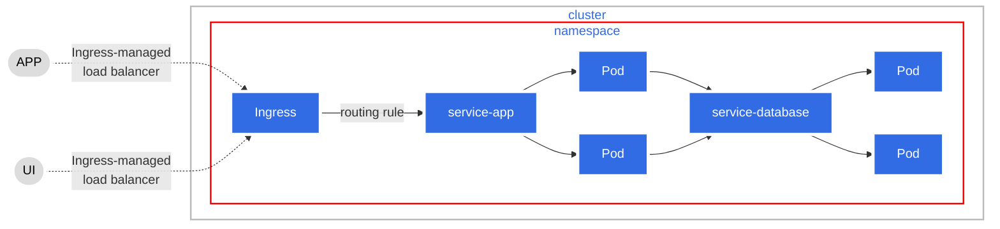

## Quelques tests à suivre ...
---
layout: center
transition: fade-out
class: 'custom-background'
---

<h2 style="text-align: center;">Architecture</h2>

 

```mermaid {theme: 'neutral', scale: 0.8}
graph  LR
  client-app([APP])-. Ingress-managed <br> load balancer .->ingress[Ingress];
  client([UI])-. Ingress-managed <br> load balancer .->ingress[Ingress];
  ingress-->|routing rule|service-app[service-app];
  subgraph cluster
    subgraph namespace
      ingress;
      service-app-->pod1[Pod];
      service-app-->pod2[Pod];
      pod1-->service-database;
      pod2-->service-database;
      service-database-->pod3[Pod];
      service-database-->pod4[Pod]
    end
  end
  classDef plain fill:#ddd,stroke:#fff,stroke-width:4px,color:#000;
  classDef k8s fill:#326ce5,stroke:#fff,stroke-width:4px,color:#fff;
  classDef cluster fill:#fff,stroke:#bbb,stroke-width:2px,color:#326ce5;
  classDef namespace fill:#fff,stroke:#ff0000,stroke-width:2px,color:#326ce5; 
  class ingress,service-app,service-database,pod1,pod2,pod3,pod4 k8s;
  class client plain;
  class client-app plain;
  class namespace namespace;
  class cluster cluster;
```